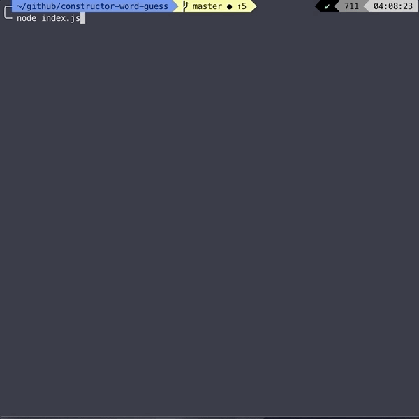

# Constructors (JS) Assignment - Word-Guess Game

## Overview
This assignment used Node.js and JS Constructors to create a CLI version of the Word-Guess Game, where the user tries to guess the title of a series from Netflix.
Using the `inquirer` Node.js package, input from the user is obtained from the command line; and using methods that belong to the `Word` and `Letter` Constructors, validating the user's guess was pretty straightforward. 
Also, code from the first version of this assignmnet (`https://github.com/moralh2/Word-Guess-Game`) was re-used to create some of the game logic by creating a `game` object.

## Node Packages
This app uses two Node.js packages:
* inquirer - to prompt user in terminal for input
* chalk - to add styling to console output

## Set-up for the App
In order to use the app, you must have Node.js installed.

First, clone the repo, and then run the following to install all of the dependencies from the directory:
```javascript
npm install
```

## Using the App
To use the app call `index.js` with Node.js; then you'll be prompted to enter a letter in the command line in order to guess the title of the TV show. After each guess, the game prints if your guess was correct, incorrect, or if it had already been attempted. Once the word is guessed or you've gotten 10 wrong guesses, the current round will end. At the end of a round, the game will output the current score and move to the next TV show. The game ends once all the user tries to guess all of the shows; the game prints the final tally at the end, and the app exits.

## Examples of the App in use

### Start game 


### Guessing on intial round


### Guessing on final round
